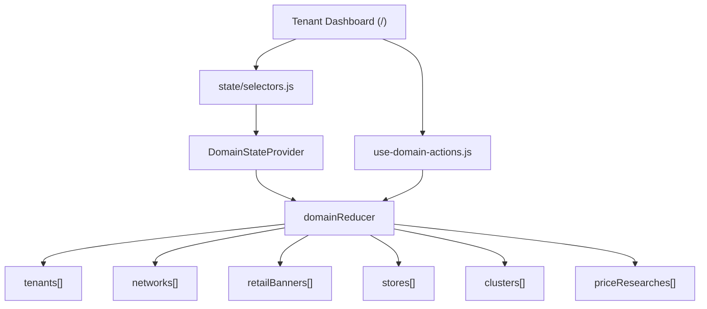

# Geo Next

Aplicacao Next.js com arquitetura multi-tenant e persistencia local (`localStorage`).

- Dashboard principal: `/`
- Lista de CONTA: `/accounts`
- Formulario de CONTA: `/accounts/new`
- Lista de Redes: `/networks`
- Formulario de Rede: `/networks/new`
- Edicao de Rede: `/networks/[id]/edit`
- Lista de Bandeiras: `/banners`
- Formulario de Bandeira: `/banners/new`
- Edicao de Bandeira: `/banners/[id]/edit`
- Lista de Lojas: `/stores`
- Lista de Concorrentes: `/competitors`
- Formulario de Loja: `/stores/new`
- Formulario de Loja Concorrente: `/stores/competitors/new`
- Edicao de Loja: `/stores/[id]/edit`
- Lista de Clusters: `/clusters`
- Formulario de Cluster: `/clusters/new`
- Edicao de Cluster: `/clusters/[id]/edit`
- Lista de Pesquisas: `/researches`
- Formulario de Pesquisa: `/researches/new`
- Edicao de Pesquisa: `/researches/[id]/edit`
- Banco de dados (import/export por colecao): `/database`
- Mapa legado React (fluxo anterior): `/map`

## Rodando localmente

```bash
npm install
npm run dev
```

Build de producao:

```bash
npm run build
npm start
```

## Estilos (Tailwind)

- Tailwind CSS configurado no projeto (`tailwind.config.js` + `postcss.config.js`).
- UI principal migrada para classes utilitarias Tailwind no JSX.
- Classes aplicadas diretamente nos componentes (`className` inline), sem camada intermediaria de mapeamento.

## Modelo de dominio

O dominio principal foi modelado em `features/domain/models/`:

- `tenant-model.js`
- `network-model.js`
- `retail-banner-model.js`
- `store-model.js`
- `cluster-level-model.js`
- `cluster-model.js`
- `price-research-model.js`

### Relacoes

```txt
Tenant (PF/PJ)
|- Network (1..n)
   |- sector (enum)
   |- segment (enum)
   |- headquarter (endereco administrativo + lat/lon)
   |- RetailBanner (1..n)
      |- Store (1..n, cada loja em 1 unica bandeira)
|- Cluster (1..n)
   |- levels[] (niveis proprios do cluster: padrao + custom)
   |- own_store_ids (1..n lojas proprias da mesma rede/bandeira)
   |- competitor_groups (niveis -> 1..n lojas concorrentes)
|- PriceResearch (1..n)
   |- cluster_id
   |- competitor_store_ids (subset dos concorrentes do cluster)
   |- products[] (gtin, name, category)
```

Observacao de UI:

- no sistema interno o nome tecnico continua `tenant`
- na interface do dashboard o rotulo exibido e `CONTA`
- existe uma sidebar global com atalhos para dashboard e modulos principais (`conta`, `redes`, `bandeira`, `lojas`, `concorrentes`, `clusters`, `pesquisas`)
- o dashboard (`/dashboard`) exibe cabecalho, contadores clicaveis e uma secao de acompanhamento rapido de servicos de pesquisa
- os contadores do dashboard sao clicaveis e levam para as paginas correspondentes
- a secao de servicos no dashboard possui busca por nome com debounce (300ms), filtros por status/periodo, ordenacao e paginacao incremental (`Ver mais`)

## Estado React (Dashboard)

Estado central em `features/domain/state/domain-state.jsx`.



### Arvore de estado atual

```txt
state
|- meta
|  |- activeTenantId
|- tenants[]
|- networks[]
|- retailBanners[]
|- stores[]
|- clusters[]
|- priceResearches[]
```

## Backup / Restore (JSON)

No dashboard (`/`) existe suporte de backup por tenant:

- `Exportar JSON`: gera snapshot completo do tenant ativo
- `Importar JSON`: restaura snapshot de tenant (se o tenant ja existir, os dados dele sao substituidos)

No cadastro de CONTA (`/accounts/new`):

- endereco inicial (cidade/estado/rua/numero) pode ser consultado no Nominatim
- campos complementares de endereco + latitude/longitude sao preenchidos automaticamente
- upload de logo da conta em base64

No cadastro de Rede (`/networks/new` e `/networks/[id]/edit`):

- seletores de `setor` e `segmento` (baseados nos enums do model)
- formulario de endereco administrativo da rede (`headquarter`)
- consulta Nominatim para completar endereco e coordenadas (lat/lon)

No cadastro de Bandeira (`/banners/new` e `/banners/[id]/edit`):

- seletores de `network_type` e `network_channel` (enums do model)
- upload de logo via endpoint interno `/api/imgbb/upload`
- armazenamento do objeto `logo` com URLs (`image`, `display`, `thumb`, `medium`, `delete_url`)
- campo legado `logo_url` mantido por compatibilidade
- dashboard prioriza `logo.thumb_url` para manter a UI limpa

No cadastro de Lojas (`/stores/new` e `/stores/[id]/edit`):

- loja propria (`OWN`) herda visualmente o logo da bandeira associada
- loja concorrente (`COMPETITOR`) usa `competitor_banner_name` + `competitor_banner_logo`
- regra: concorrente deve usar bandeira diferente das bandeiras cadastradas na rede
- campos extras: `internal_code`, `short_name`; `store_number` apenas para loja propria
- formulario de endereco completo com consulta Nominatim (preenche `address` e `geo`)
- upload opcional da foto de fachada via endpoint interno `/api/imgbb/upload`
- armazenamento da fachada no objeto `facade` (com `image`, `display`, `thumb`, `medium`, `delete_url`)

Cadastro dedicado de concorrente:

- rota `/stores/competitors/new` abre o mesmo formulario com `kind=COMPETITOR` bloqueado

No cadastro de Clusters (`/clusters/new` e `/clusters/[id]/edit`):

- dashboard exibe listagem simples de clusters com resumo por nivel
- criacao/edicao de cluster foi movida para formulario dedicado
- formulario permite selecionar lojas proprias e concorrentes agrupados por nivel
- cada cluster possui seus proprios niveis de concorrencia (`levels[]`)
- gestao de niveis de concorrencia foi centralizada nesta pagina (nao fica mais no dashboard)

No cadastro de Pesquisas (`/researches/new` e `/researches/[id]/edit`):

- dashboard exibe apenas listagem simples de pesquisas
- criacao/edicao de pesquisa foi movida para formulario dedicado
- selecao de concorrentes respeita os concorrentes definidos no cluster

No dashboard (`/dashboard`), secao de servicos de pesquisa:

- lista servicos por tenant ativo com status (`ATIVO`/`SUSPENSO`), cluster, inicio/prazo, recorrencia e resumo de niveis/produtos
- a busca por nome ignora acentos/caixa e aplica debounce de 300ms
- filtros adicionais: status e periodo por data de inicio
- ordenacao: mais recentes, mais antigos, inicio mais recente e nome (A-Z)
- paginacao incremental em blocos (`Ver mais` / `Mostrar menos`)

Variavel de ambiente para upload de imagens:

```bash
IMGBB_KEY=seu_token_aqui
```

Formato do snapshot exportado:

```json
{
  "schema_version": 1,
  "exported_at": "2026-02-21T00:00:00.000Z",
  "tenant": {},
  "networks": [],
  "retailBanners": [],
  "stores": [],
  "clusterLevels": [],
  "clusters": [],
  "priceResearches": []
}
```

`clusterLevels` permanece no snapshot apenas por compatibilidade com backups antigos.

## Carga em lote

No dashboard (`/`), os blocos principais possuem botao `Criar em lote (JSON)`:

- Tenant
- Redes
- Bandeiras
- Lojas (proprias e concorrentes)

Na pagina `/database`, voce tem upload/download por colecao:

- Tenants
- Redes
- Bandeiras
- Lojas proprias
- Lojas concorrentes
- Listas de pesquisa

Cada card da pagina `/database` tambem possui `Baixar template`, com exemplo de JSON para preenchimento rapido.

Ordem recomendada para importacao:

1. Tenants
2. Redes
3. Bandeiras
4. Lojas proprias
5. Lojas concorrentes
6. Listas de pesquisa (exige cluster ja existente e concorrentes vinculados no cluster)

## Onde alterar cada parte

- Models e validacoes: `features/domain/models/`
- Reducer e persistencia local: `features/domain/state/`
- Regras de escrita e validacoes de negocio: `features/domain/hooks/use-domain-actions.js`
- UI do dashboard: `components/tenant-dashboard-app.jsx` e `features/dashboard/components/`

## Imgur API

Para criar chave: 

```txt
https://api.imgbb.com/
```
